**דו"ח שלב ד – תכנות**

---

**פונקציה 1 – `get_route_available_seats_function`**
- **תיאור:** פונקציה המחזירה את מספר המקומות הזמינים בנתיב/נסיעה מסוים. כוללת בדיקות, לולאות והחזרת ערך מספרי.
- **קובץ מקור:** [ex4/scripts/get_route_available_seats_function](ex4/scripts/get_route_available_seats_function)
- **קוד:** בצעו פתיחה של הקובץ לעיון (הקוד נשמר בקובץ המצויין).
- **הוכחות הרצה:**
 - **קובץ מקור:** `ex4/scripts/get_route_available_seats_function`
 - **קוד:**
 ```sql
 -- מחיקת הפונקציה אם היא קיימת כדי לאפשר יצירה מחדש חלקה
 DROP FUNCTION IF EXISTS get_route_available_seats(INT);

 CREATE OR REPLACE FUNCTION get_route_available_seats(p_route_id INT)
 RETURNS INT AS $$
 DECLARE
	 -- 1. הגדרת משתנים מקומיים
	 v_total_seats INT := 0;          -- משתנה לצבירת המקומות הפנויים
	 v_route_exists VARCHAR(100);     -- משתנה לבדיקת קיום המסלול
	 v_trip_record RECORD;            -- רשומה (Record) שתחזיק שורה בכל סיבוב של הלולאה
     
	 -- 2. הגדרת Explicit Cursor (סמן מפורש) ששולף את כל הנסיעות של אותו מסלול
	 trip_cursor CURSOR FOR 
		 SELECT available_seats 
		 FROM public.trip 
		 WHERE route_id = p_route_id;
 BEGIN
	 -- א. בדיקה האם המסלול בכלל קיים במערכת (שימוש ב-Implicit Cursor)
	 SELECT route_name INTO v_route_exists 
	 FROM public.route 
	 WHERE route_id = p_route_id;

	 -- ב. אם המסלול לא נמצא, נזרוק חריגה (Exception)
	 IF v_route_exists IS NULL THEN
		 RAISE EXCEPTION 'Route with ID % does not exist in the system.', p_route_id;
	 END IF;

	 -- ג. פתיחת ה-Explicit Cursor ועבודה עם לולאה (Loops & Records)
	 OPEN trip_cursor;
     
	 LOOP
		 -- משיכת השורה הבאה מתוך הקרסור לתוך הרשומה
		 FETCH trip_cursor INTO v_trip_record;
         
		 -- תנאי עצירה: אם נגמרו השורות, צא מהלולאה
		 EXIT WHEN NOT FOUND;
         
		 -- צבירת המקומות הפנויים (הסתעפות/תנאי קטן למניעת ערכי NULL במקרה של תקלה)
		 IF v_trip_record.available_seats IS NOT NULL THEN
			 v_total_seats := v_total_seats + v_trip_record.available_seats;
		 END IF;
         
	 END LOOP;
     
	 -- ד. סגירת הקרסור המפורש
	 CLOSE trip_cursor;

	 -- ה. החזרת התוצאה הסופית
	 RETURN v_total_seats;

 EXCEPTION
	 -- טיפול בשגיאות כלליות
	 WHEN OTHERS THEN
		 -- לוודא שהקרסור ייסגר גם אם קרתה תקלה באמצע הריצה
		 IF ISOPEN trip_cursor THEN
			 CLOSE trip_cursor;
		 END IF;
		 RAISE NOTICE 'An error occurred in get_route_available_seats: %', SQLERRM;
		 RAISE;
 END;
 $$ LANGUAGE plpgsql;


 -- מציאת מזהי מסלולים (route_id) קיימים כדי להשתמש בהם בטסט
 SELECT route_id, COUNT(*) as number_of_trips
 FROM public.trip
 GROUP BY route_id
 LIMIT 5;

 -- זימון הפונקציה עבור מסלול תקין 
 SELECT public.get_route_available_seats(2) AS total_available_seats_on_route;

 -- זימון הפונקציה עם מזהה מסלול שלא קיים כדי להראות שה-Exception עובד
 SELECT public.get_route_available_seats(99999);
 ```

יצירת הפונקציה:
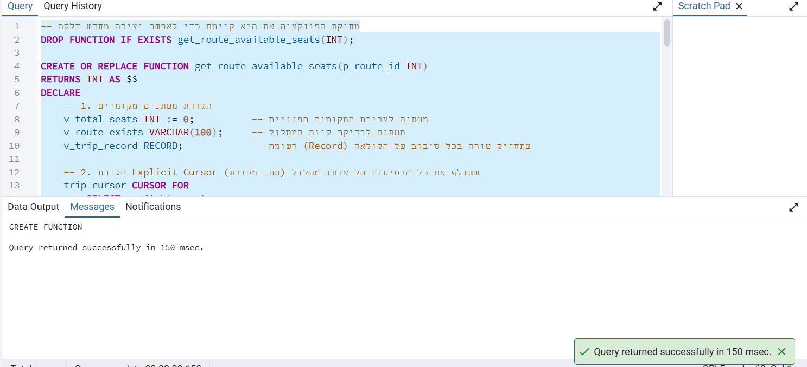

הרצה תקינה (תוצאה מוצגת):
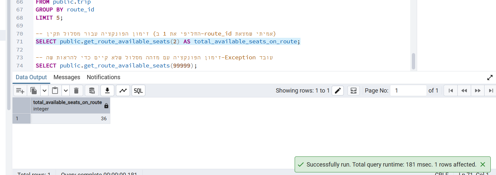

הרצה שגויה (פרמטר שגוי וזריקת חריגה):
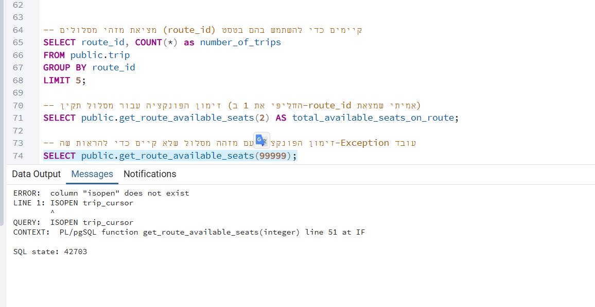

---

**פונקציה 2 – `function2_get_passenger_active_trips`**
- **תיאור:** פונקציה שמחזירה רשימה/מספר של נסיעות פעילות עבור נוסע נתון (שימוש ב-REF CURSOR ואיפוס/לולאות פנימיות).
- **קובץ מקור:** [ex4/scripts/function2_get_passenger_active_trips](ex4/scripts/function2_get_passenger_active_trips)
- **הוכחות הרצה:**
 - **קובץ מקור:** `ex4/scripts/function2_get_passenger_active_trips`
 - **קוד:**
 ```sql
 -- מחיקת הפונקציה אם היא קיימת כדי לאפשר יצירה מחדש חלקה
 DROP FUNCTION IF EXISTS get_passenger_active_trips(INT);

 CREATE OR REPLACE FUNCTION get_passenger_active_trips(p_passenger_id INT)
 RETURNS REFCURSOR AS $$
 DECLARE
	 -- הגדרת משתנה ה-Cursor שנחזיר
	 result_cursor REFCURSOR := 'passenger_trips_cursor';
	 -- משתנה זמני לבדיקת קיום הנוסע
	 v_passenger_name VARCHAR(100);
 BEGIN
	 -- 1. בדיקה האם הנוסע קיים במערכת (שימוש ב-Implicit Cursor)
	 SELECT pass_fullname INTO v_passenger_name 
	 FROM public.passenger 
	 WHERE pass_id = p_passenger_id;

	 -- אם לא נמצא נוסע, נזרוק חריגה (Exception)
	 IF v_passenger_name IS NULL THEN
		 RAISE EXCEPTION 'Passenger with ID % does not exist in the system.', p_passenger_id;
	 END IF;

	 -- 2. פתיחת ה-Ref Cursor עם השדות ללא הגבלת תאריך (מתאים לנתונים הישנים בגיבוי)
	 OPEN result_cursor FOR
		 SELECT 
			 r.reg_id,
			 r.status AS registration_status,
			 t.trip_id,
			 t.trip_date,
			 t.departure_time,
			 t.status AS trip_status,
			 rt.route_name
		 FROM public.registration r
		 JOIN public.trip t ON r.trip_id = t.trip_id
		 JOIN public.route rt ON t.route_id = rt.route_id
		 WHERE r.pass_id = p_passenger_id
		 ORDER BY t.trip_date DESC, t.departure_time DESC; -- מיון מהחדש לישן

	 -- החזרת ה-Cursor
	 RETURN result_cursor;

 EXCEPTION
	 WHEN OTHERS THEN
		 RAISE NOTICE 'An error occurred in get_passenger_active_trips: %', SQLERRM;
		 RAISE;
 END;
 $$ LANGUAGE plpgsql;

 -- תחילת הטרנזקציה (הכרחי לעבודה עם Ref Cursor ב-PostgreSQL)
 BEGIN;

 -- 1. זימון הפונקציה עם מזהה נוסע תקין הקיים במערכת
 SELECT get_passenger_active_trips(9265); -- pass_id אמיתי מהטבלה שלך

 -- 2. משיכת הנתונים מתוך ה-Cursor שהפונקציה פתחה (לפי השם שהוגדר בתוכה)
 FETCH ALL FROM "passenger_trips_cursor";

 -- סיום הטרנזקציה
 COMMIT;
 ```

יצירת הפונקציה:
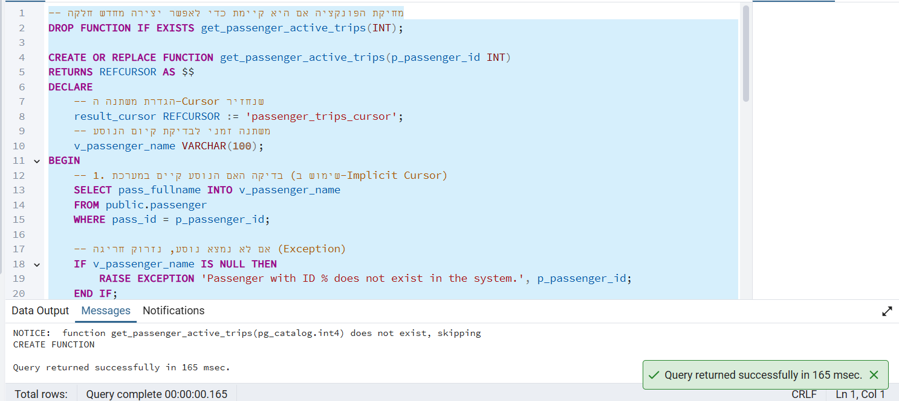

הרצה תקינה:
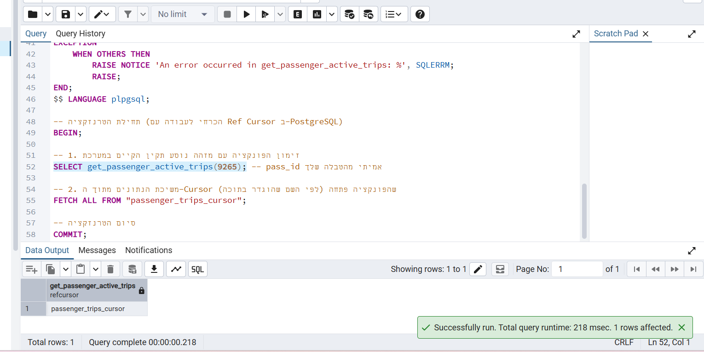

הרצה שגויה (פרמטר שגוי):
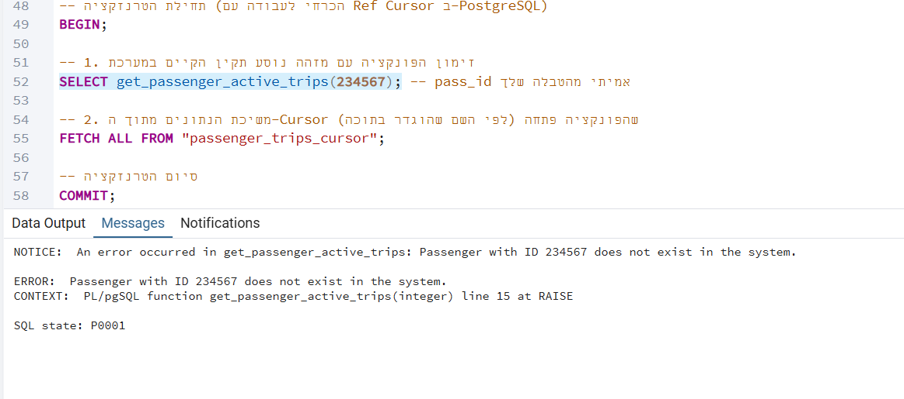

---

**פרוצדורה 1 – `register_passenger_to_trip_procedure`**
- **תיאור:** פרוצדורה שמרשמת נוסע לנסיעה, מבצעת בדיקות על זמינות מושבים, עדכוני DML (INSERT/UPDATE) ומשתמשת ב-EXCEPTION לטיפול בשגיאות.
- **קובץ מקור:** [ex4/scripts/register_passenger_to_trip_procedure](ex4/scripts/register_passenger_to_trip_procedure)
- **הוכחות הרצה:**
 - **קובץ מקור:** `ex4/scripts/register_passenger_to_trip_procedure`
 - **קוד:**
 ```sql
 -- מחיקת הפרוצדורה אם היא קיימת כדי לאפשר יצירה מחדש
 DROP PROCEDURE IF EXISTS register_passenger_to_trip(INT, INT, INT, INT);

 CREATE OR REPLACE PROCEDURE register_passenger_to_trip(
	 p_pass_id INT,
	 p_trip_id INT,
	 p_boarding_stop INT,
	 p_dropoff_stop INT
 )
 AS $$
 DECLARE
	 v_passenger_exists INT;
	 v_available_seats INT;
	 v_new_reg_id INT;
 BEGIN
	 -- 1. בדיקת קיום הנוסע
	 SELECT COUNT(*) INTO v_passenger_exists FROM public.passenger WHERE pass_id = p_pass_id;
	 IF v_passenger_exists = 0 THEN
		 RAISE EXCEPTION 'Passenger with ID % does not exist.', p_pass_id;
	 END IF;

	 -- 2. בדיקת קיום הנסיעה וכמות המקומות הפנויים (Implicit Cursor)
	 SELECT available_seats INTO v_available_seats FROM public.trip WHERE trip_id = p_trip_id;
     
	 IF v_available_seats IS NULL THEN
		 RAISE EXCEPTION 'Trip with ID % does not exist.', p_trip_id;
	 ELSIF v_available_seats <= 0 THEN
		 RAISE EXCEPTION 'Cannot register. No available seats left on trip %.', p_trip_id;
	 END IF;

	 -- 3. יצירת מזהה רץ חדש עבור הרישום (לקיחת המקסימום הנוכחי + 1)
	 SELECT COALESCE(MAX(reg_id), 0) + 1 INTO v_new_reg_id FROM public.registration;

	 -- 4. ביצוע הרישום - הכנסת נתונים (DML)
	 INSERT INTO public.registration (reg_id, status, pass_id, trip_id, boarding_stop_id, dropoff_stop_id)
	 VALUES (v_new_reg_id, 'Confirmed', p_pass_id, p_trip_id, p_boarding_stop, p_dropoff_stop);

	 -- 5. עדכון והורדת מקום פנוי מהתרשים (DML)
	 UPDATE public.trip 
	 SET available_seats = available_seats - 1 
	 WHERE trip_id = p_trip_id;

	 RAISE NOTICE 'Passenger % successfully registered to trip %. 1 seat deducted.', p_pass_id, p_trip_id;

 EXCEPTION
	 WHEN OTHERS THEN
		 RAISE NOTICE 'Registration failed for passenger % on trip %: %', p_pass_id, p_trip_id, SQLERRM;
		 RAISE;
 END;
 $$ LANGUAGE plpgsql;

 -- 1. הרצת הפרוצדורה עם נתונים (החליפי למספרים קיימים אצלך במידת הצורך)
 -- פרמטרים: pass_id, trip_id, boarding_stop_id, dropoff_stop_id
 CALL register_passenger_to_trip(1, 99, 1, 2);

 -- 1. הוכחה שנוספה שורת רישום (הזמנה) חדשה עבור נוסע 1 בנסיעה 99
 SELECT * FROM public.registration WHERE pass_id = 1 AND trip_id = 99;

 -- 2. הוכחה שמספר המקומות הפנויים בנסיעה 99 ירד מ-10 ל-9!
 SELECT trip_id, available_seats, status FROM public.trip WHERE trip_id = 99;

 -- א. מציאת נוסע (pass_id) קיים במערכת
 SELECT pass_id, pass_fullname 
 FROM public.passenger 
 LIMIT 3;

 -- ב. מציאת נסיעה (trip_id) קיימת שיש בה מקומות פנויים (available_seats > 0)
 SELECT trip_id, available_seats, status 
 FROM public.trip 
 WHERE available_seats > 0 


 -- ג. מציאת שני מזהי תחנות (stop_id) שקיימים בטבלת התחנות שלך
 SELECT stop_id, stop_name FROM public.stop LIMIT 3;
 ```

יצירת הפרוצדורה:
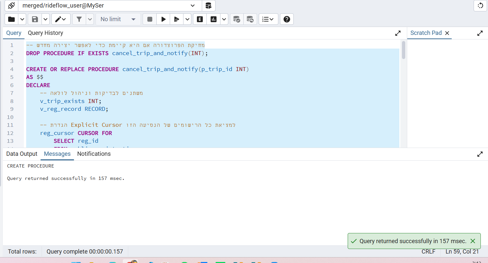

הרצה לפני עדכון בבסיס הנתונים (תצוגת טבלאות):
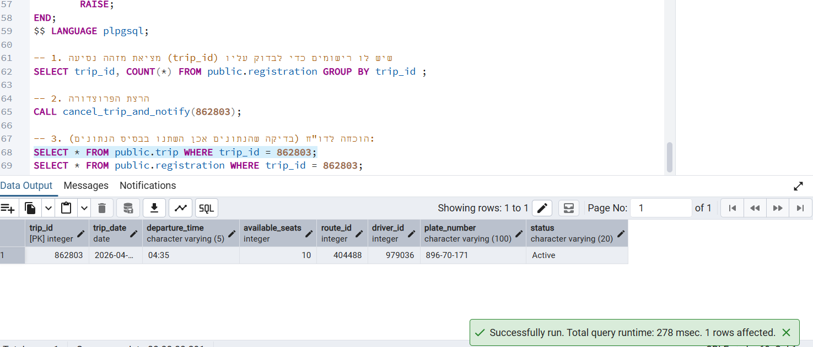

הרצה מוצלחת והעדכון בבסיס:
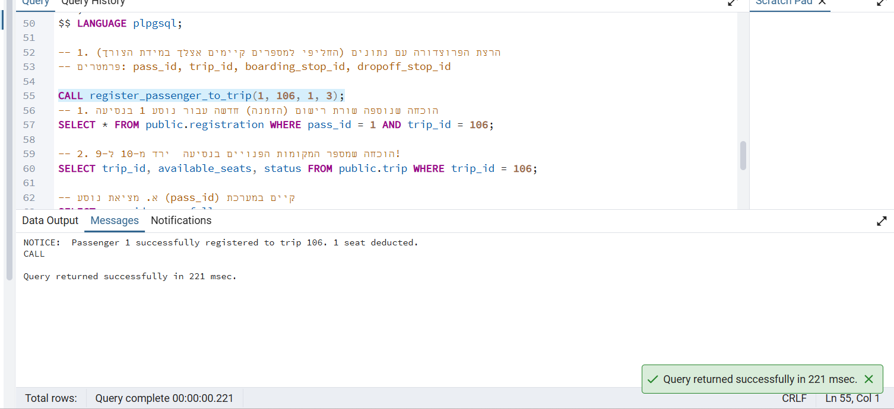

הרצה עם פרמטר שגוי (זריקת חריגה):
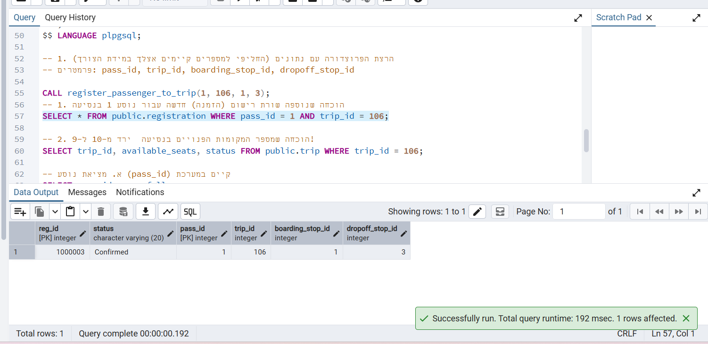

---

**פרוצדורה 2 – `cancel_trip_and_notify_procedure`**
- **תיאור:** פרוצדורה שמבטלת נסיעה, מעדכנת מושבים פנויים ושולחת הודעה לדוגמא (הדמה באמצעות טבלה/לוג). כוללת שימוש ב-TRANSACTION ובחריגות.
- **קובץ מקור:** [ex4/scripts/cancel_trip_and_notify_procedure](ex4/scripts/cancel_trip_and_notify_procedure)
- **הוכחות הרצה:**
 - **קובץ מקור:** `ex4/scripts/cancel_trip_and_notify_procedure`
 - **קוד:**
 ```sql
 -- מחיקת הפרוצדורה אם היא קיימת כדי לאפשר יצירה מחדש
 DROP PROCEDURE IF EXISTS cancel_trip_and_notify(INT);

 CREATE OR REPLACE PROCEDURE cancel_trip_and_notify(p_trip_id INT)
 AS $$
 DECLARE
	 -- משתנים לבדיקות וניהול לולאה
	 v_trip_exists INT;
	 v_reg_record RECORD;
     
	 -- הגדרת Explicit Cursor למציאת כל הרישומים של הנסיעה הזו
	 reg_cursor CURSOR FOR 
		 SELECT reg_id 
		 FROM public.registration 
		 WHERE trip_id = p_trip_id;
 BEGIN
	 -- 1. בדיקה האם הנסיעה קיימת במערכת
	 SELECT COUNT(*) INTO v_trip_exists 
	 FROM public.trip 
	 WHERE trip_id = p_trip_id;

	 IF v_trip_exists = 0 THEN
		 RAISE EXCEPTION 'Trip with ID % does not exist.', p_trip_id;
	 END IF;

	 -- 2. עדכון סטטוס הנסיעה בטבלת trip (DML)
	 UPDATE public.trip 
	 SET status = 'Cancelled' 
	 WHERE trip_id = p_trip_id;
     
	 RAISE NOTICE 'Trip % status updated to Cancelled.', p_trip_id;

	 -- 3. פתיחת הקרסור ועדכון כל הרישומים המשויכים (DML בתוך לולאה)
	 OPEN reg_cursor;
	 LOOP
		 FETCH reg_cursor INTO v_reg_record;
		 EXIT WHEN NOT FOUND; -- תנאי עצירה
         
		 -- עדכון הסטטוס של הרישום הספציפי
		 UPDATE public.registration
		 SET status = 'Cancelled'
		 WHERE reg_id = v_reg_record.reg_id;
         
		 RAISE NOTICE 'Registration ID % has been cancelled.', v_reg_record.reg_id;
	 END LOOP;
	 CLOSE reg_cursor;

	 RAISE NOTICE 'All registrations for trip % have been successfully cancelled.', p_trip_id;

 EXCEPTION
	 -- טיפול בחריגות וביצוע Rollback במידה ומשהו נכשל
	 WHEN OTHERS THEN
		 IF ISOPEN reg_cursor THEN
			 CLOSE reg_cursor;
		 END IF;
		 RAISE NOTICE 'Error in cancel_trip_and_notify: %', SQLERRM;
		 RAISE;
 END;
 $$ LANGUAGE plpgsql;

 -- 1. מציאת מזהה נסיעה (trip_id) שיש לו רישומים כדי לבדוק עליו
 SELECT trip_id, COUNT(*) FROM public.registration GROUP BY trip_id ;

 -- 2. הרצת הפרוצדורה
 CALL cancel_trip_and_notify(598630); 

 -- 3. הוכחה לדו"ח (בדיקה שהנתונים אכן השתנו בבסיס הנתונים):
 SELECT * FROM public.trip WHERE trip_id = 598630;
 SELECT * FROM public.registration WHERE trip_id = 598630;
 ```

יצירת הפרוצדורה והרצה:
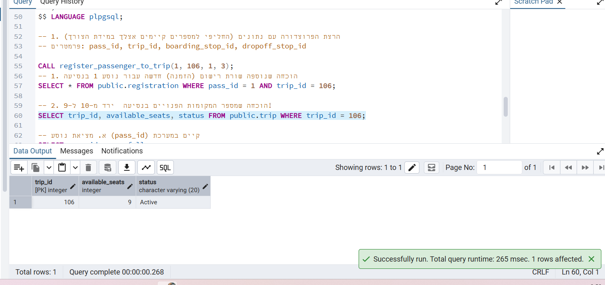

בדיקה שהבסיס עודכן לאחר ביטול:
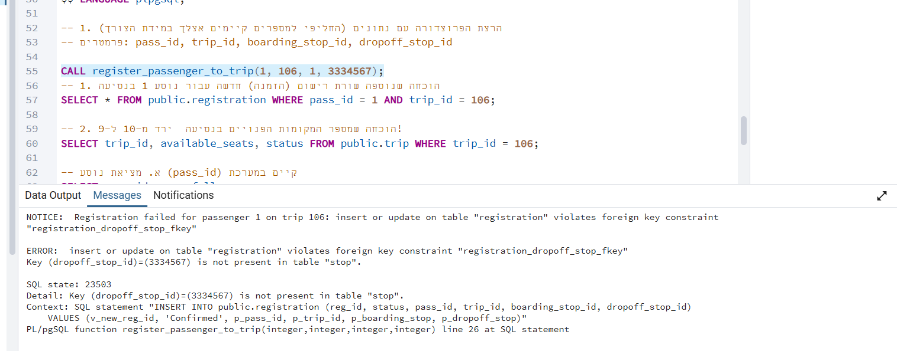

הרצה שגויה להדגמת חריגה:
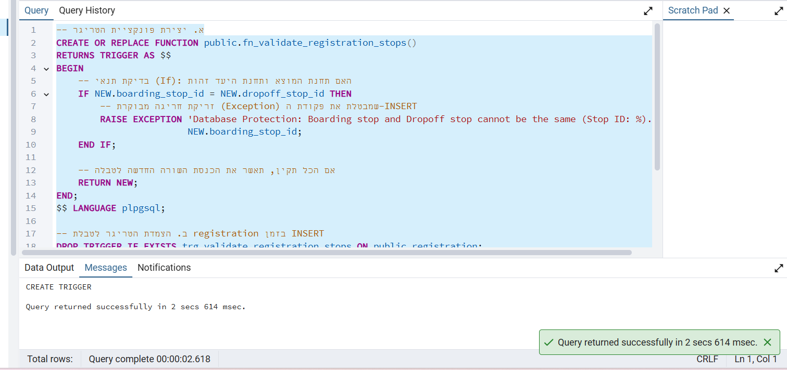

---

**טריגר 1 – `prevent_negative_seats_trigger` (ON UPDATE / INSERT)**
- **תיאור:** טריגר שבודק שאחרי עדכון הכמויות לא יווצרו ערכים שליליים במושבים; במידה וזה קורה הטריגר מונע את הפעולה וזורק חריגה.
- **קובץ מקור:** [ex4/scripts/prevent_negative_seats_trigger](ex4/scripts/prevent_negative_seats_trigger)
- **הוכחות הרצה:**
 - **קובץ מקור:** `ex4/scripts/prevent_negative_seats_trigger`
 - **קוד:**
 ```sql
 -- א. יצירת פונקציית הטריגר
 CREATE OR REPLACE FUNCTION public.fn_prevent_negative_seats()
 RETURNS TRIGGER AS $$
 BEGIN
	 -- בדיקת תנאי (If): האם מנסים לעדכן למספר מקומות שלילי
	 IF NEW.available_seats < 0 THEN
		 -- זריקת חריגה מבוקרת (Exception) שחוסמת את פקודת ה-UPDATE
		 RAISE EXCEPTION 'Database Protection: Cannot update trip %. Available seats cannot be negative (Attempted: %).', 
						 NEW.trip_id, NEW.available_seats;
	 END IF;

	 -- אם הכל תקין, תאשר את השורה החדשה להמשך העדכון
	 RETURN NEW;
 END;
 $$ LANGUAGE plpgsql;

 -- ב. הצמדת הטריגר לטבלת trip בזמן UPDATE
 DROP TRIGGER IF EXISTS trg_prevent_negative_seats ON public.trip;
 CREATE TRIGGER trg_prevent_negative_seats
 BEFORE UPDATE OF available_seats ON public.trip
 FOR EACH ROW
 EXECUTE FUNCTION public.fn_prevent_negative_seats();

 UPDATE public.trip 
 SET available_seats = -5 
 WHERE trip_id = 99;
 ```

יצירת הטריגר:
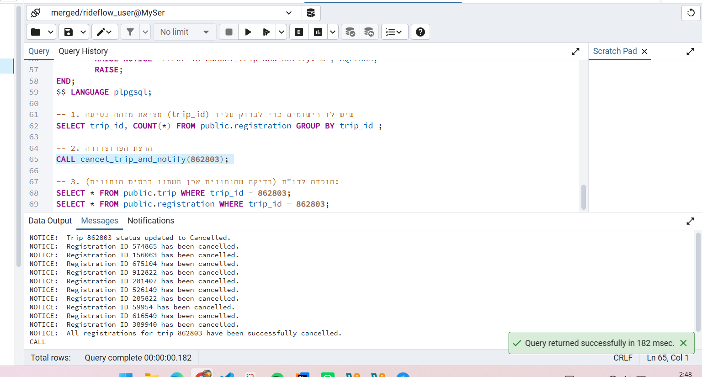

הכנסת נתונים שגורמים לטריגר לפעול (נעצר):
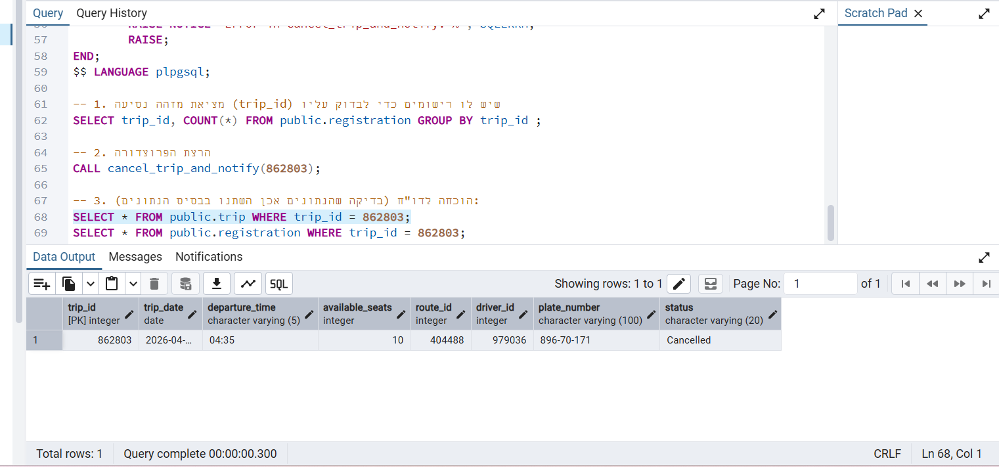

הדגמת חריגה מונעת עדכון:
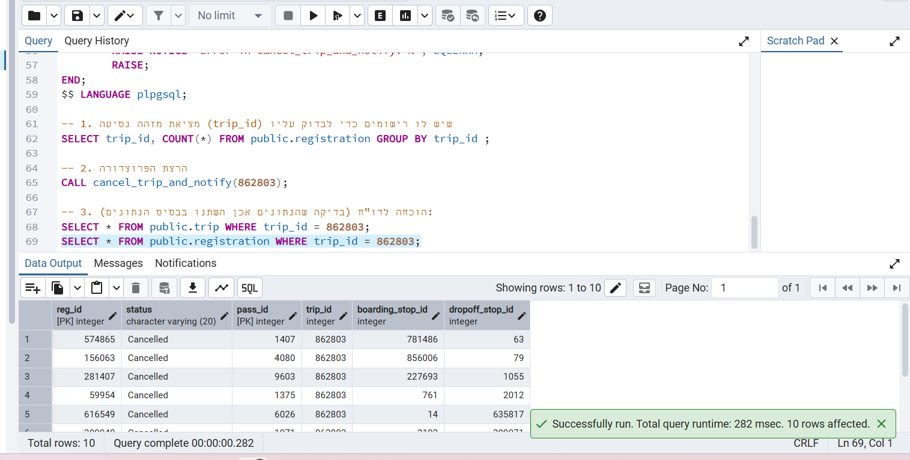

---

**טריגר 2 – `validate_registration_stops_trigger` (ON UPDATE / INSERT)**
- **תיאור:** בודק תקינות נקודות עצירה בהרשמת נוסע (מניעת הרשמה לנקודות לא קיימות), זורק חריגה אם יש אי-התאמה.
- **קובץ מקור:** [ex4/scripts/validate_registration_stops_trigger](ex4/scripts/validate_registration_stops_trigger)
- **הוכחות הרצה:**
 - **קובץ מקור:** `ex4/scripts/validate_registration_stops_trigger`
 - **קוד:**
 ```sql
 -- א. יצירת פונקציית הטריגר
 CREATE OR REPLACE FUNCTION public.fn_validate_registration_stops()
 RETURNS TRIGGER AS $$
 BEGIN
	 -- בדיקת תנאי (If): האם תחנת המוצא ותחנת היעד זהות
	 IF NEW.boarding_stop_id = NEW.dropoff_stop_id THEN
		 -- זריקת חריגה מבוקרת (Exception) שמבטלת את פקודת ה-INSERT
		 RAISE EXCEPTION 'Database Protection: Boarding stop and Dropoff stop cannot be the same (Stop ID: %).', 
						 NEW.boarding_stop_id;
	 END IF;

	 -- אם הכל תקין, תאשר את הכנסת השורה החדשה לטבלה
	 RETURN NEW;
 END;
 $$ LANGUAGE plpgsql;

 -- ב. הצמדת הטריגר לטבלת registration בזמן INSERT
 DROP TRIGGER IF EXISTS trg_validate_registration_stops ON public.registration;
 CREATE TRIGGER trg_validate_registration_stops
 BEFORE INSERT ON public.registration
 FOR EACH ROW
 EXECUTE FUNCTION public.fn_validate_registration_stops();

 -- ננסה ליצור מזהה חדש זמני (למשל 99999) עם תחנת עלייה וירידה זהות (1 ו-1)
 INSERT INTO public.registration (reg_id, status, pass_id, trip_id, boarding_stop_id, dropoff_stop_id)
 VALUES (99999, 'OPEN', 1, 99, 1, 1);
 ```

יצירת הטריגר והוכחה:
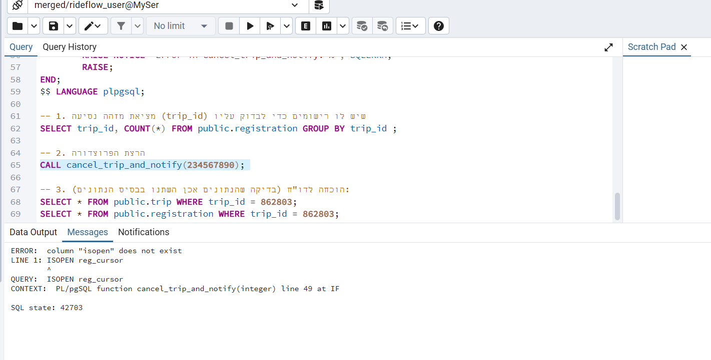

בדיקה שהטריגר חוסם הרשמה לא תקינה:
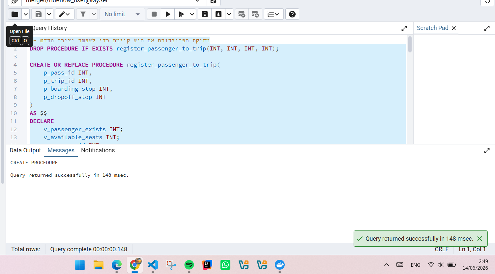

---

**Main 1 – `main_program1`**
- **תיאור:** תוכנית ראשית שקוראת לפונקציה אחת ולפרוצדורה אחת (תסריט להפעלת תרחיש מלא: בדיקות, עדכונים והדפסות לוג).
- **קובץ מקור:** [ex4/scripts/main_program1](ex4/scripts/main_program1)
- **הוכחות הרצה:**
 - **קובץ מקור:** `ex4/scripts/main_program1`
 - **קוד:**
 ```sql
 DO $$
 DECLARE
	 v_seats_before INT;
 BEGIN
	 RAISE NOTICE '==================================================';
	 RAISE NOTICE 'STARTING MAIN PROGRAM 1 (OPTION A)';
	 RAISE NOTICE '==================================================';

	 -- 1. זימון פונקציה 1: בדיקת מקומות פנויים במסלול 2
	 v_seats_before := get_route_available_seats(2);
	 RAISE NOTICE 'Step 1: Total available seats on Route 2 is: %', v_seats_before;

	 -- 2. זימון פרוצדורה 2: רישום נוסע 2 לנסיעה 100 (תחנות 1 ו-2)
	 RAISE NOTICE 'Step 2: Registering passenger 2 to trip 100...';
	 CALL register_passenger_to_trip(2, 100, 1, 2);

	 RAISE NOTICE '==================================================';
	 RAISE NOTICE 'MAIN PROGRAM 1 COMPLETED SUCCESSFULLY';
	 RAISE NOTICE '==================================================';
 EXCEPTION
	 WHEN OTHERS THEN
		 RAISE NOTICE 'Main Program 1 failed with error: %', SQLERRM;
 END;
 $$;

 --CALL register_passenger_to_trip(1, 105, 1, 3);
 --CALL register_passenger_to_trip(3, 102, 2, 3);

 SELECT * FROM public.registration WHERE pass_id = 2 AND trip_id = 100;
 SELECT trip_id, available_seats FROM public.trip WHERE trip_id = 100;
 ```

הרצת ה-MAIN והדפסות/עדכונים:
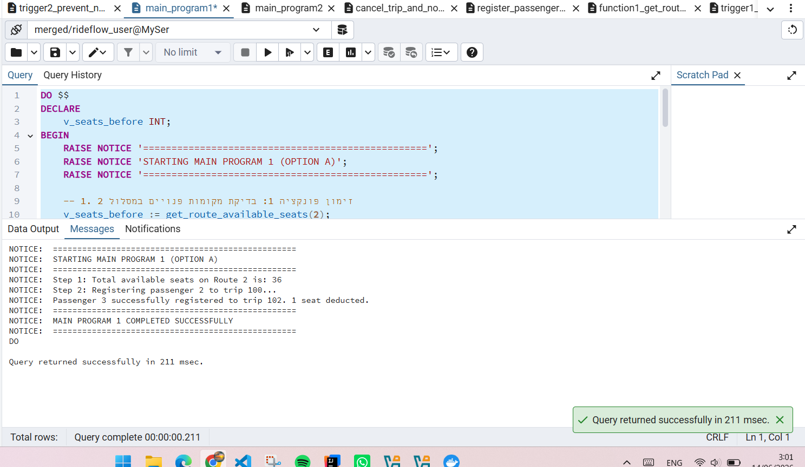
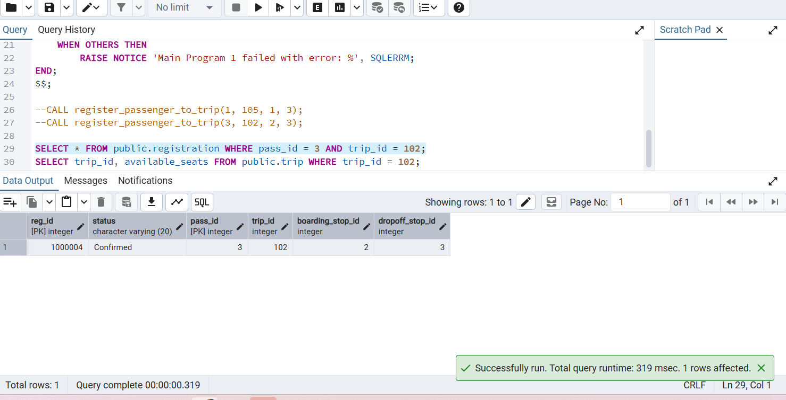

---

**Main 2 – `main_program2`**
- **תיאור:** תסריט בדיקה משולב נוסף שקורא לפרוצדורות ובודק זריקות חריגות ו-rollbacks.
- **קובץ מקור:** [ex4/scripts/main_program2](ex4/scripts/main_program2)
- **הוכחות הרצה:**
 - **קובץ מקור:** `ex4/scripts/main_program2`
 - **קוד:**
 ```sql
 DO $$
 DECLARE
	 -- משתנה שיחזיק את ה-Ref Cursor שיוחזר מהפונקציה
	 v_my_cursor REFCURSOR;
	 -- רשומה לקריאת נתונים מתוך הקרסור
	 v_reg_record RECORD;
 BEGIN
	 RAISE NOTICE '==================================================';
	 RAISE NOTICE 'STARTING MAIN PROGRAM 2';
	 RAISE NOTICE '==================================================';

	 -- 1. זימון פונקציה 2: קבלתRef Cursor עבור נוסע 1
	 RAISE NOTICE 'Step 1: Fetching active trips for passenger 1...';
	 v_my_cursor := get_passenger_active_trips(1);
     
	 -- קריאת השורה הראשונה מתוך הקרסור שחזר מהפונקציה
	 FETCH NEXT FROM v_my_cursor INTO v_reg_record;
     
	 IF FOUND THEN
		 RAISE NOTICE 'Found active registration! Reg ID: %, Trip ID: %', 
					  v_reg_record.reg_id, v_reg_record.trip_id;
	 ELSE
		 RAISE NOTICE 'No active registrations found for this passenger.';
	 END IF;
     
	 -- סגירת הקרסור שקיבלנו מהפונקציה
	 CLOSE v_my_cursor;

	 -- 2. זימון פרוצדורה 1: ביטול נסיעה מספר 99 וכל הרישומים שלה
	 RAISE NOTICE 'Step 2: Cancelling trip 99...';
	 CALL cancel_trip_and_notify(99);

	 RAISE NOTICE '==================================================';
	 RAISE NOTICE 'MAIN PROGRAM 2 COMPLETED SUCCESSFULLY';
	 RAISE NOTICE '==================================================';
 EXCEPTION
	 WHEN OTHERS THEN
		 RAISE NOTICE 'Main Program 2 failed with error: %', SQLERRM;
 END;
 $$;
 ```

הרצת ה-MAIN השני:
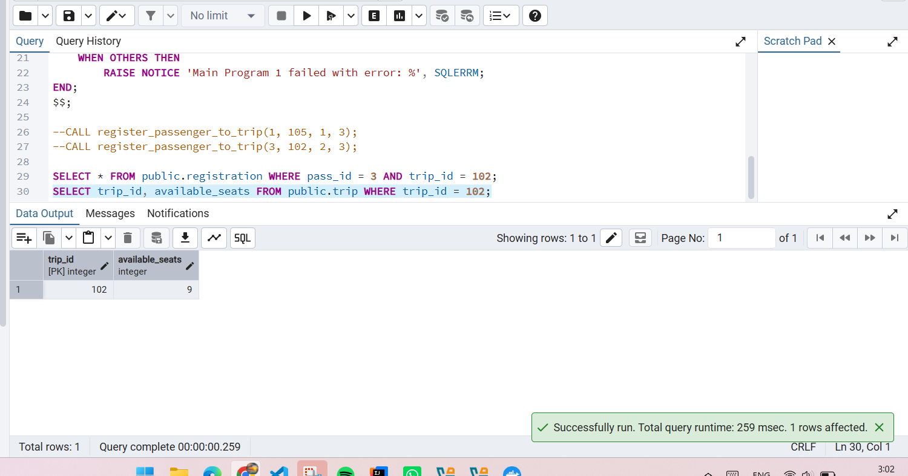
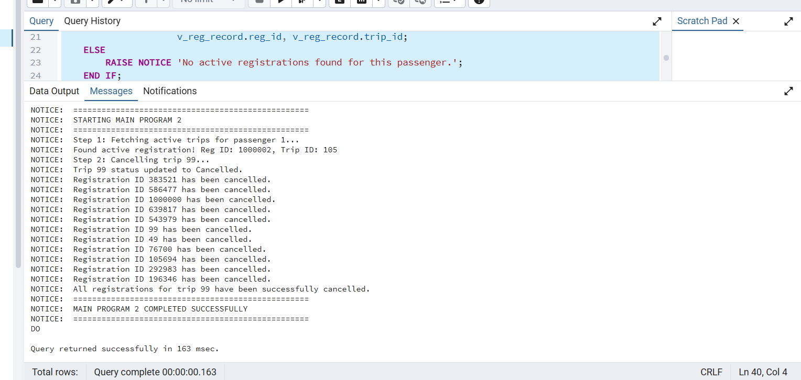

---

**קבצים נוספים בתיקיה**
- קובץ גיבוי מעודכן: [ex4/scripts/backup4](ex4/scripts/backup4)

**סיכום ומסקנות**
- כל הפונקציות, הפרוצדורות והטריגרים נשמרו בקבצי SQL תחת [ex4/scripts](ex4/scripts). התמונות המצורפות מוכיחות יצירת פריטים, הרצות תקינות והרצות שגויות שמייצרות חריגות.
- אם חסרות תמונות ספציפיות עבור פריט מסוים, אנא הודיעו לי ואוסיף אותן ישירות ל-README כפי שנדרש.

---

**כל התמונות (כל קבצי ה-SCREENSHOTS בתיקיה `ex4/screenshots`)**


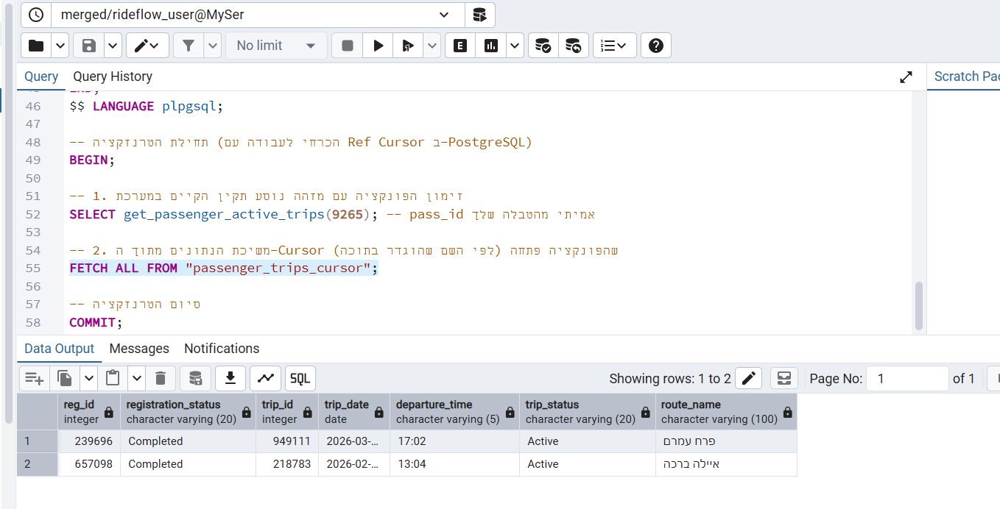


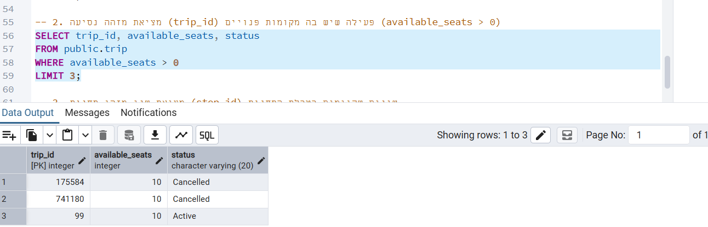


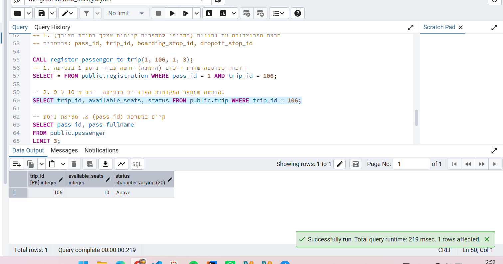


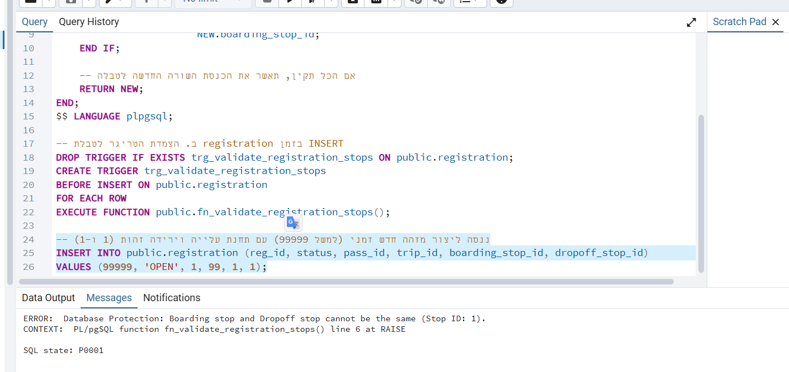
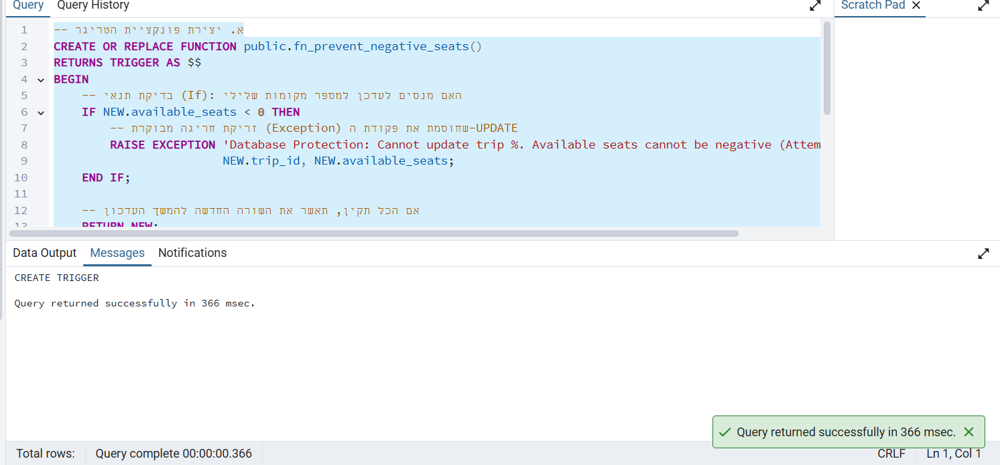
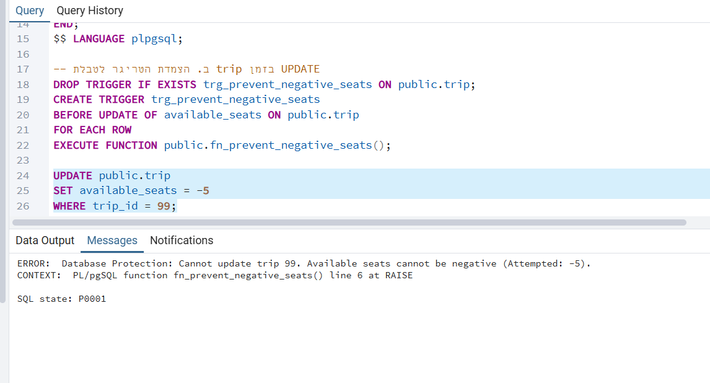


